# Laboratorio de Conexión de una Base datos en SQL SERVER a un lenguaje de programación  

## Objetivo

Crear la base de datos para gestor de recetas de cocina en SQL SERVER y posteriormente conectarlo con un lenguaje de programación de alto nivel

- [X] JAVA
- [ ] C#
- [ ] VB

Este lenguaje se seleccionara durante la lección.

### Requisitos

- [SQL Server Express 2019 o superior.](https://www.microsoft.com/es-es/sql-server/sql-server-downloads)
- [SQL Server Management Studio (SSMS) en su ultima versión](https://learn.microsoft.com/es-es/sql/ssms/download-sql-server-management-studio-ssms?view=sql-server-ver16) - [Guía Instalación de SQL SERVER 2019 & SSMS](https://seth09work.notion.site/Instalaci-n-y-configuraci-n-del-sistema-gestor-de-bases-de-datos-de-SQL-SERVER-9027a9827de34d9a82076f2caaa3f706?pvs=4)
- Lenguaje de programación (**Java**, C#, VB, etc.) y su respectivo IDE de desarrollo.
  - [JAVA JDK 11 o Superior](https://www.oracle.com/java/technologies/javase/jdk17-archive-downloads.html)
  - [NetBeans en su versión 17 o superior](https://netbeans.apache.org/)
  - [JDBC de SQL SERVER para JAVA.](https://learn.microsoft.com/en-us/sql/connect/jdbc/microsoft-jdbc-driver-for-sql-server?view=sql-server-ver16)

## Construcción de la base de datos

Para iniciar con la creación de la aplicación se deberá elaborar la base de datos que se utilizara, junto con algunos procedimiento almacenados y funciones que se necesitaran desde la aplicación, para ello se iniciara ilustrando cuales serán las tablas y sus atributos:

### 1. Diseño de la base de datos

1. Abrir SSMS y conectarse al servidor SQL Server.
2. Crear una nueva base de datos con el nombre "dbGestorRecetas".
3. Elabore las siguientes tablas:

**Tabla 1: tblRecetas**
Atributos:

- IdReceta (INT - PRIMARY KEY - IDENTITY)
- Nombre (VARCHAR(100))
- Descripcion (TEXT)
- TiempoPreparacion (INT)
- Dificultad (INT)
- Imagen (IMAGE)

**Tabla 2: tblIngredientes**
Atributos:

- IdIngrediente (INT - PRIMARY KEY - IDENTITY)
- Nombre (VARCHAR(50))
- UnidadMedida (VARCHAR(10))

**Tabla 3: tblRecetasIngredientes**
Atributos:

- IdReceta (INT, FOREIGN KEY)
- IdIngrediente (INT, FOREIGN KEY)
- Cantidad (DECIMAL)
- PRIMARY KEY (IdReceta, IdIngrediente)

**Tabla 4: tblPasos**
Atributos:

- IdPaso (INT - PRIMARY KEY - IDENTITY)
- IdReceta (INT, FOREIGN KEY)
- NumeroPaso (INT)
- Descripcion (TEXT)

**Tabla 5: tblCategoria**
Atributos:

- IdCategoria (INT - PRIMARY KEY - IDENTITY)
- Nombre (VARCHAR(50))

**Tabla 6: tblRecetasCategoria**
Atributos:

- IdReceta (INT - FOREIGN KEY)
- IdCategoria (INT, FOREIGN KEY)
- PRIMARY KEY (IdReceta, idCategoria)

**Se adjunta el diagrama relacional de la base de datos:**

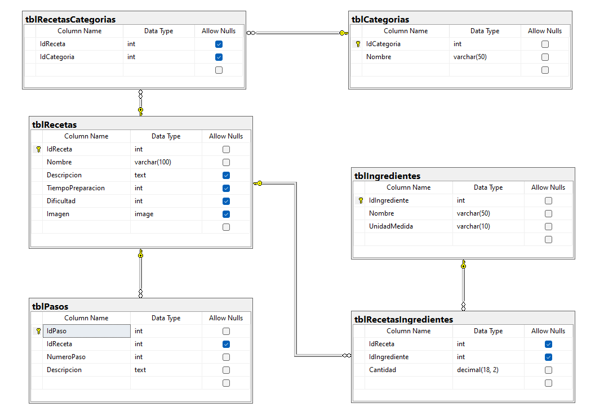

***Se adjunta el Script de la base de datos:***

```sql
CREATE DATABASE dbGestorRecetas;
GO

USE dbGestorRecetas;
GO

CREATE TABLE tblRecetas (
    IdReceta INT PRIMARY KEY IDENTITY,
    Nombre VARCHAR(100) NOT NULL,
    Descripcion TEXT,
    TiempoPreparacion INT,
    Dificultad INT,
    Imagen image,
    FechaModificacion DATE
);
GO

CREATE TABLE tblIngredientes (
    IdIngrediente INT PRIMARY KEY IDENTITY,
    Nombre VARCHAR(50) NOT NULL,
    UnidadMedida VARCHAR(10) NOT NULL
);
GO

CREATE TABLE tblRecetasIngredientes (
    IdReceta INT FOREIGN KEY REFERENCES tblRecetas(IdReceta),
    IdIngrediente INT FOREIGN KEY REFERENCES tblIngredientes(IdIngrediente),
    Cantidad decimal(18,2) NOT NULL
);
GO

CREATE TABLE tblPasos (
    IdPaso INT PRIMARY KEY IDENTITY,
    IdReceta INT FOREIGN KEY REFERENCES tblRecetas(IdReceta),
    NumeroPaso INT NOT NULL,
    Descripcion TEXT NOT NULL
);
GO

CREATE TABLE tblCategorias (
    IdCategoria INT PRIMARY KEY IDENTITY,
    Nombre VARCHAR(50) NOT NULL
);
GO

CREATE TABLE tblRecetasCategorias (
    IdReceta INT FOREIGN KEY REFERENCES tblRecetas(IdReceta),
    IdCategoria INT FOREIGN KEY REFERENCES tblCategorias(IdCategoria)
);
GO
```

### 2. Implementación de funciones y procedimientos almacenados

A continuación se deberá de elaborar cada uno de los siguientes procedimientos almenados y funciones.

1. Procedimientos para la gestión de recetas:
   1. Obtener recetas: Obtener una lista de todas las recetas.

    ```sql
    CREATE or ALTER PROCEDURE spObtenerRecetas
    AS
    BEGIN
        SELECT IdReceta,Nombre, Descripcion, TiempoPreparacion, Dificultad, Imagen, FechaModificacion FROM tblRecetas
    END
    
    -- Probar el procedimiento almacenado (SP)
    EXEC spObtenerRecetas
    GO
   ```

   2. Obtener receta por ID: Obtener la información de una receta específica.

    ```sql
        CREATE or ALTER PROCEDURE spObtenerRecetaID
        @idReceta INT
        AS
        BEGIN
            SELECT IdReceta, Nombre, Descripcion, TiempoPreparacion, Dificultad, Imagen, FechaModificacion FROM tblRecetas WHERE IdReceta = @idReceta
        END
        
        -- Probar el procedimiento almacenado (SP)
        EXEC spObtenerRecetaID 1
        GO
    ```

   3. Agregar receta: Crear una nueva receta, tomar en cuenta la posibilidad de enviar las categorías a la que pertenece la receta.

    ```sql
    CREATE or ALTER PROCEDURE spAgregarReceta
    @nombre VARCHAR(100),
    @descripcion TEXT,
    @tiempoPreparacion INT,
    @dificultad INT,
    @Imagen IMAGE
    AS
    BEGIN    	
        INSERT INTO tblRecetas (Nombre, Descripcion, TiempoPreparacion,Dificultad,Imagen,FechaModificacion) VALUES (@nombre,@descripcion,@tiempoPreparacion,@dificultad,@Imagen,GETDATE())
    END
    
    -- Probar el procedimiento almacenado (SP)
    EXEC spAgregarReceta 'Tres leches', 'Postre que es un queque con tres leches', 60, 2, null;
    GO
    ```

   4. Editar receta: Modificar la información de una receta existente.

    ```sql
    CREATE or ALTER PROCEDURE spEditarReceta
    @IdReceta INT,
    @nombre VARCHAR(100),
    @descripcion TEXT,
    @tiempoPreparacion INT,
    @dificultad INT,
    @Imagen IMAGE
    AS
    BEGIN
        UPDATE tblRecetas SET Nombre= @nombre, Descripcion = @descripcion, TiempoPreparacion = @tiempoPreparacion, Dificultad = @dificultad, Imagen = @Imagen, FechaModificacion = GETDATE() WHERE IdReceta = @IdReceta
    END
    
    ---- Probar el procedimiento almacenado (SP)
    EXEC spEditarReceta 1,'Tres leches El mejor', 'Postre que es un queque con tres leches', 60, 2, null;
    GO
    ```

   5. Eliminar recetas: Eliminar una receta del sistema.

    ```sql
    CREATE or ALTER PROCEDURE spEliminarReceta
    @IdReceta INT
    AS
    BEGIN
        DELETE FROM tblRecetas WHERE IdReceta = @IdReceta
    END
    
    ---- Probar el procedimiento almacenado (SP)
    EXEC spEliminarReceta 1;
    GO
    ```

2. Procedimientos para la gestión de Ingredientes:
   1. Obtener Ingredientes: Obtener una lista de todos los Ingredientes de un receta.

   ```sql
    CREATE PROCEDURE spObtenerIngredientesPorReceta
        @IdReceta INT
    AS
    BEGIN
        SELECT i.*
        FROM tblIngredientes i
        INNER JOIN tblRecetasIngredientes ri ON i.IdIngrediente = ri.IdIngrediente
        WHERE ri.IdReceta = @IdReceta;
    END;
    GO
    ```

   2. Obtener Ingrediente por ID: Obtener la información de un Ingrediente específico.

    ```sql
    CREATE PROCEDURE spObtenerIngredientePorID
    @IdIngrediente INT
    AS
    BEGIN
        SELECT IdIngrediente,Nombre,UnidadMedida FROM tblIngredientes WHERE IdIngrediente = @IdIngrediente;
    END;
    GO
    ```

   3. Agregar Ingrediente: Crear un nuevo Ingrediente.

    ```sql
    CREATE PROCEDURE spAgregarIngrediente
    @Nombre VARCHAR(50),
    @UnidadMedida VARCHAR(10)
    AS
    BEGIN
        INSERT INTO tblIngredientes (Nombre, UnidadMedida)
        VALUES (@Nombre, @UnidadMedida);
    END;
    GO
    ```

   4. Editar Ingrediente: Modificar la información de un Ingrediente existente.

    ```sql
    CREATE PROCEDURE spEditarIngrediente
        @IdIngrediente INT,
        @Nombre VARCHAR(50),
        @UnidadMedida VARCHAR(10)
    AS
    BEGIN
        UPDATE tblIngredientes
        SET Nombre = @Nombre, UnidadMedida = @UnidadMedida
        WHERE IdIngrediente = @IdIngrediente;
    END;
    GO
    ```

   5. Eliminar Ingrediente: Eliminar un Ingrediente del sistema.

    ```sql
    CREATE PROCEDURE spEliminarIngrediente
        @IdIngrediente INT
    AS
    BEGIN
        DELETE FROM tblIngredientes WHERE IdIngrediente = @IdIngrediente;
    END;
    GO
    ```

    6. Obtener todos los ingredientes que coincide con el nombre ingresado (Filtro de búsqueda).
   
    ```sql
    CREATE PROCEDURE spObtenerIngredientePorNombre
    @nombre VARCHAR(50) = NULL
    AS
    BEGIN
        SELECT IdIngrediente,Nombre, UnidadMedida FROM tblIngredientes WHERE (nombre LIKE '%' +@nombre+ '%' OR @nombre IS NULL);;
    END;
    GO
    ```

3. Procedimientos para la gestión de categorías:
   1. Obtener categorías: Obtener una lista de todas las categorías.

    ```sql
    CREATE PROCEDURE spObtenerCategorias
    AS
    BEGIN
        SELECT IdCategoria,Nombre FROM tblCategorias;
    END;
    GO
    ```

   2. Obtener categoría por ID: Obtener la información de una categoría específica.

    ```sql
    CREATE PROCEDURE spObtenerCategoriaPorID
        @IdCategoria INT
    AS
    BEGIN
        SELECT IdCategoria,Nombre FROM tblCategorias WHERE IdCategoria = @IdCategoria;
    END;
    GO
    ```

   3. Agregar categoría: Crear una nueva categoría.

    ```sql
    CREATE PROCEDURE spAgregarCategoria
        @Nombre VARCHAR(50)
    AS
    BEGIN
        INSERT INTO tblCategorias (Nombre)
        VALUES (@Nombre);
    END;
    GO
    ```

   4. Editar categoría: Modificar la información de una categoría existente.

    ```sql
    CREATE PROCEDURE spEditarCategoria
        @IdCategoria INT,
        @Nombre VARCHAR(50)
    AS
    BEGIN
        UPDATE tblCategorias
        SET Nombre = @Nombre
        WHERE IdCategoria = @IdCategoria;
    END;
    GO
    ```

   5. Eliminar categoría: Eliminar una categoría del sistema.

    ```sql
    CREATE PROCEDURE spEliminarCategoria
        @IdCategoria INT
    AS
    BEGIN
        DELETE FROM tblCategorias WHERE IdCategoria = @IdCategoria;
    END;
    GO
    ```

    6. Obtener categorías: Obtener una lista de todas las categorías según nombre (Filtro de búsqueda).

    ```sql
    CREATE PROCEDURE spObtenerCategoriasPorNombre
    @nombre VARCHAR(50) = NULL
    AS
    BEGIN
        SELECT IdCategoria,Nombre FROM tblCategorias WHERE (nombre LIKE '%' +@nombre+ '%' OR @nombre IS NULL);;
    END;
    GO
    ```

4. Procedimientos para la gestión de los pasos:
   1. Obtener pasos: Obtener una lista de todas las pasos de una receta concreta.

    ```sql
    CREATE PROCEDURE spObtenerPasosPorReceta
        @IdReceta INT
    AS
    BEGIN
        SELECT IdPaso, IdReceta, NumeroPaso, Descripcion FROM tblPasos WHERE IdReceta = @IdReceta;
    END;
    GO
    ```

   2. Obtener pasos por ID: Obtener la información del paso específico.

    ```sql
    CREATE PROCEDURE spObtenerPasoPorID
        @IdPaso INT
    AS
    BEGIN
        SELECT IdPaso, IdReceta, NumeroPaso, Descripcion FROM tblPasos WHERE IdPaso = @IdPaso;
    END;
    GO
    ```

   3. Agregar paso: Crear un nuevo paso para un receta concreta.

    ```sql
    CREATE PROCEDURE spAgregarPaso
        @IdReceta INT,
        @NumeroPaso INT,
        @Descripcion TEXT
    AS
    BEGIN
        INSERT INTO tblPasos (IdReceta, NumeroPaso, Descripcion)
        VALUES (@IdReceta, @NumeroPaso, @Descripcion);
    END;
    GO
    ```

   4. Editar paso: Modificar un nuevo paso para un receta concreta.

    ```sql
    CREATE PROCEDURE spEditarPaso
        @IdPaso INT,
        @Descripcion TEXT
    AS
    BEGIN
        UPDATE tblPasos
        SET Descripcion = @Descripcion
        WHERE IdPaso = @IdPaso;
    END;
    GO
    ```

   5. Eliminar paso: Eliminar un paso para un receta concreta.

    ```sql
    CREATE PROCEDURE spEliminarPaso
        @IdPaso INT
    AS
    BEGIN
        DELETE FROM tblPasos WHERE IdPaso = @IdPaso;
    END;
    GO
    ```

5. Procedimientos para la gestión de los Ingredientes por Receta:
   1. Agregar Ingredientes a una receta

    ```sql
    CREATE PROCEDURE spAgregarIngredientesAReceta
        @IdReceta INT,
        @IdIngrediente INT,
        @Cantidad DECIMAL(18,2)
    AS
    BEGIN
        INSERT INTO tblRecetasIngredientes (IdReceta, IdIngrediente, Cantidad)
        VALUES (@IdReceta, @IdIngrediente, @Cantidad);
    END;
    GO
    ```

   2. Editar ingrediente: Modificar un ingrediente de una receta.

    ```sql
    CREATE PROCEDURE spEditarIngredienteDeReceta
        @IdReceta INT,
        @IdIngrediente INT,
        @Cantidad DECIMAL(18,2)
    AS
    BEGIN
        UPDATE tblRecetasIngredientes
        SET Cantidad = @Cantidad
        WHERE IdReceta = @IdReceta AND IdIngrediente = @IdIngrediente;
    END;
    GO
    ```

   3. Eliminar ingrediente: Eliminar un  ingrediente para un receta concreta.

    ```sql
    CREATE PROCEDURE spEliminarIngredienteDeReceta
        @IdReceta INT,
        @IdIngrediente INT
    AS
    BEGIN
        DELETE FROM tblRecetasIngredientes
        WHERE IdReceta = @IdReceta AND IdIngrediente = @IdIngrediente;
    END;
    GO
    ```

6. Funciones para el sistema:
   1. Función para contar cuentos ingredientes tiene un receta concreta.
7. Triggers:
   1. Trigger para actualizar la fecha de modificación de una receta.
   2. Trigger para eliminar los pasos de una receta al eliminarla
   3. Trigger para registrar el historial de cambios en una receta - Agregar la tabla con los datos idReceta, fechaCambio, columna, valorAnterior, ValorNuevo.

### Configuración de SQL SERVER

Antes de iniciar con el proyecto se deberá de configurar el motor de bases de datos para que acepte las conexión atreves del protocolo TCP/IP para ello se deberá realizar lo siguiente:

### Configuración del puerto TCP/IP

Primero se debe ejecutar la aplicación **SQL Server 2022 Configuration Manager** para habilitar el puerto TCP/IP
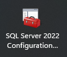
En la ventana que se despliega se deberá seleccionar la opción **SQL Server Network Configuration** → **Protocols for SQLEXPRESS** (Esta ultima depende la versión de SQL SERVER), luego se deberá dar clic en la opción **TCP/IP**:

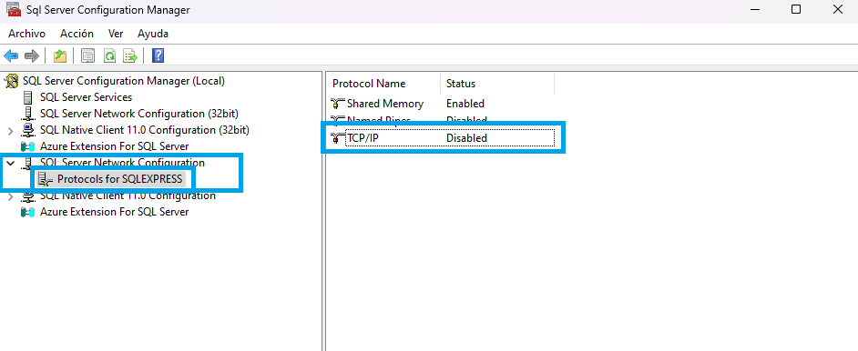

En la ventana que se despliega se deberá configurar en la pestaña **Protocol** la opción de **Enabled en Yes** a como se muestra en la imagen:

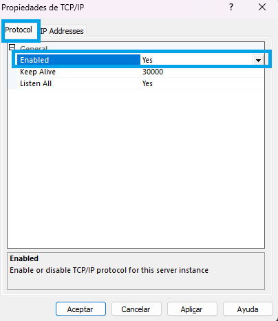

luego en la pestaña de **IP Addresses** se deberá de configurar la opción de **IPALL** colocando el **TCP Dynamic Ports** en **1433** a como se muestra en la imagen:

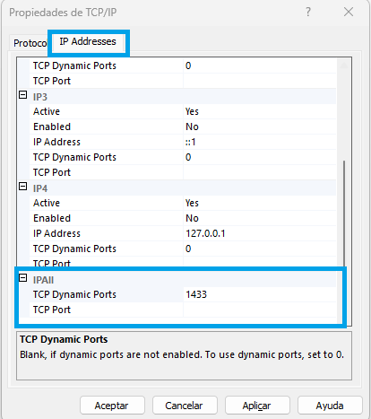

Luego se deberá dar clic en el botón **Aplicar** y para que los cambios surtan efecto se deberá reiniciar el motor de bases de datos, a ello se debe dar clic en **SQL Server Services** luego clic derecho en **SQL Server (SQLEXPRESS)** y clic en **Restart**.

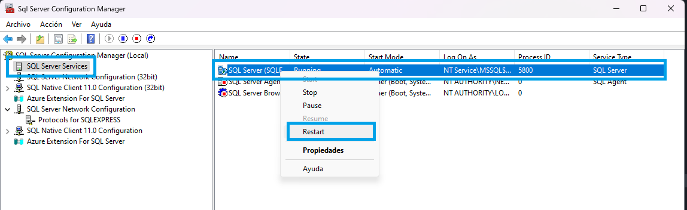

#### Crear usuario en SQL SERVER

Para este paso se deberá tener en cuenta que en la [Guía de Instalación de SQL SERVER 2019 & SSMS](https://seth09work.notion.site/Instalaci-n-y-configuraci-n-del-sistema-gestor-de-bases-de-datos-de-SQL-SERVER-9027a9827de34d9a82076f2caaa3f706?pvs=4), se habilita la autenticación para usuario SQL SERVER, por lo que se da por entendido que ya se encuentra activado, por lo que se procede a crear el usuario:

1. Se deberá dar clic en la carpeta **Security**, luego clic derecho en **Logins** y luego en **New Login**

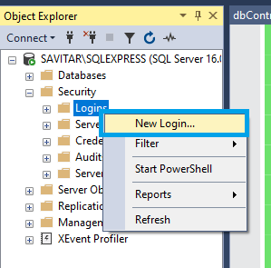

2. En la ventana que se despliega, se deberá configurar el usuario según lo que se muestra en la siguientes imágenes:

*General*
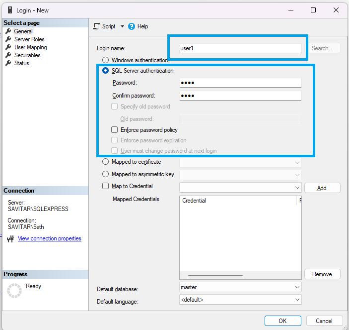

*Server Roles*
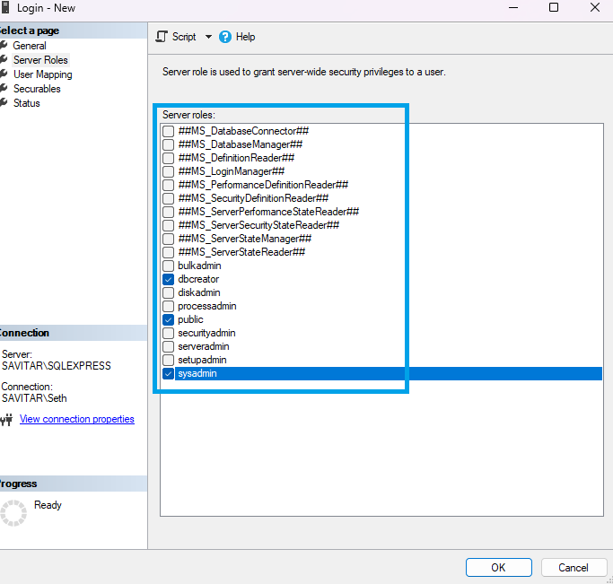

### Desarrollo de la aplicación

Antes de iniciar con el desarrollo de la aplicación se explicara brevemente que es el JDBC:

#### Que es JDBC

JDBC se deriva de la abreviatura de Java™ EE Database Connectivity, que se refiere a la conectividad de bases de datos en el contexto de desarrollo de Java EE. Es una tecnología ampliamente reconocida en el ámbito de Java EE y se utiliza comúnmente para facilitar la interacción con bases de datos. JDBC opera como una interfaz de programación a nivel de llamadas, lo que implica que las consultas SQL se transmiten como secuencias a esta interfaz. Luego, la interfaz se encarga de ejecutar estas consultas en sistemas de gestión de bases de datos relacionales (RDBMS). Un aspecto destacable es que las secuencias que contienen estas consultas pueden ser modificadas durante la ejecución, lo que confiere a JDBC un carácter dinámico.

##### Pasos para crear un Conexión en JAVA a través de JDBC

1. Cargar el **DRIVER** de JAVA para la Motor de base de datos a utilizar.
2. Establecer la conexión con la base de datos.
3. Crear las sentencias a ejecutar.
4. Ejecutar las sentencias.
5. Trabajar con los resultados obtenidos de la ejecución de sentencias (Cuando se requiere).
6. Cerrar los objetos de la conexión utilizados.

##### Driver JDBC para SQL SERVER

- Se encuentra en el paquete ***com.microsoft.sqlserver.jdbc***
- Se utiliza la clase ***SQLServerDriver***

*Nota: Esto puede variar dependiendo del driver a utilizar y del motor de la base de datos.*

### 1. Crear el proyecto

Primero se deberá elaborar el proyecto utilizando el IDE de NetBeans, en este caso el tipo de proyecto sera **Java Application** que se encuentra en la categoría de **Java with Ant**


Luego se deberá definir elementos como el nombre del proyecto y la ruta donde se almacenara, en este caso solo se modificara el nombre del proyecto por "appRecetas-SQLSERVER-2024"


### 2. Crear los paquetes a utilizar

Ahora se requiere crear 4 paquetes ademas del generado por defecto por NetBeans, estos paquetes serán: **gui, lib, resources, connection, modelJDBC**, deberá de quedar a como se muestra en la siguiente imagen:


### 3. Agregar librería de JDBC al proyecto

***Nota: Se recomienda la creación de un paquete dentro del proyecto en el cual se almacene dicho archivo, por ejemplo: en el paquete con nombre lib***

Para agregar la librería de JDBC al proyecto, previamente se debió descargar de los enlaces colocados en el aparatado de *Requerimientos* y luego se deberá dar clic derecho sobre la carpeta **Libraries** y luego clic en **Add JAR/Folder** a como se muestra en la imagen:

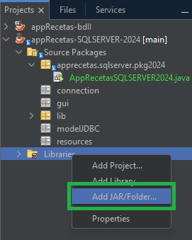

En la ventana que se despliega se deberá de localizar el  JDBC.

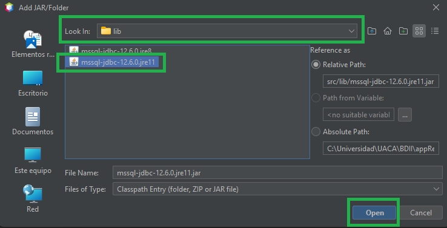

Con estos pasos se deberá haber agregado la librería del JDBC al proyecto:

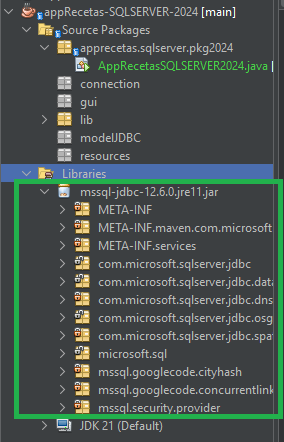

#### Crear la clase de conexión en el paquete "connection"

Para ello se deberá crear un nuevo paquete con el nombre de **connection** y dentro de este paquete se deberá agregar una clase con el nombre **connectionSQLServer** a como se muestran en las siguientes imágenes:

***Clic derecho sobre el paquete connection → New  → Java Class***

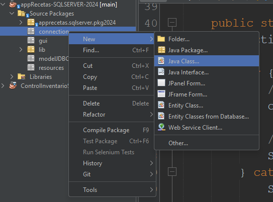

***Colocamos el nombre de la clase***

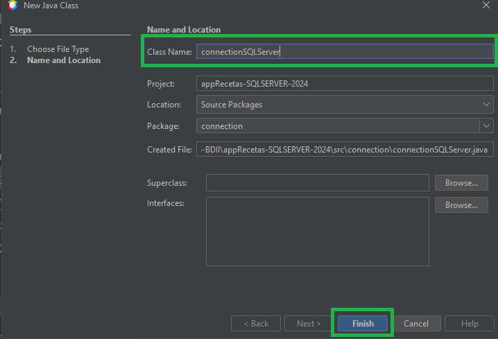

Antes de iniciar debemos importar la librería **java.sql**

```java
import java.sql.*;
```

En la clase creada anteriormente se deberá crear el código necesario para realizar la conexión, en este caso se plantea separarlo en una clase para su reutilización, para ellos se iniciara definiendo unas constantes para la clase conexión:

*Nota:* Los valores del **JDBC_DRIVER, JDBC_DB, JDBC_USER, JDBC_PASS**: debe ser cambiados de acuerdo a las necesidades

``` java
     //String que especifica el driver de conexión
    private static String JDBC_DRIVER = "com.microsoft.sqlserver.jdbc.SQLServerDriver";
    //String que especifica el nombre de la base de datos a la que se realizara la conexión
    private static String JDBC_DB = "dbGestorRecetas";
    //String que especifica el nombre de usuario con el que se conectara a la BD
    private static String JDBC_USER = "user1";
    //String que especifica la contraseña del usuario con el que se conectara a la BD
    private static String JDBC_PASS = "1234";
    //Variable que almacena el driver creado.
    private static Driver driver = null;
    //String que especifica la ruta de conexión a la base de datos 
    private static String JDBC_URL = "jdbc:sqlserver://localhost:1433;databaseName="+JDBC_DB+";encrypt=false";
```

En este punto se deberá crear el método para retornar la conexión creada, utilizando el siguiente código:

``` java
public static synchronized Connection getConnection() throws SQLException {

        if (driver == null) {
            try {
                
                //Se Carga el driver JDBC
                Class jdbcDriverClass = Class.forName(JDBC_DRIVER);

                //Utiliza para crear una instancia de la clase del controlador JDBC cargada previamente
                driver = (Driver) jdbcDriverClass.getDeclaredConstructor().newInstance();
               
                //Se utiliza para registrar el controlador JDBC que has creado previamente con la instancia
                DriverManager.registerDriver(driver);

            } catch (Exception ex) {
                System.out.println("Fallo al cargar el driver");
                ex.printStackTrace();
            }
        }
        //Establecer una conexión a la base de datos utilizando los detalles de conexión proporcionados
        return DriverManager.getConnection(JDBC_URL, JDBC_USER, JDBC_PASS);
    }
        
```

Por ultimo en esta clase se deberá crear los métodos para el cierre tanto de la conexión,los ResultSet asi como de los PreparedStatement (*es una interfaz en Java que se utiliza para ejecutar consultas SQL parametrizadas en bases de datos a través de JDBC (Java Database Connectivity)*), de la siguiente manera:

``` java
  //cierra los ResultSet abiertos.
  public static void close(ResultSet rs) {
        try {
            if (rs != null) {
                rs.close();
            }
        } catch (SQLException ex) {
            ex.printStackTrace();
        }
    }

  //Cierra los PreparedStatement abiertos, si lo están
  public static void close(PreparedStatement stmt) {
        try {
            if (stmt != null) {
                stmt.close();
            }
        } catch (SQLException ex) {
            ex.printStackTrace();
        }
    }

    //Cierra la conexión abierta, si lo están
    public static void close(Connection conn) {
        try {
            if (conn != null) {
                conn.close();
            }
        } catch (SQLException ex) {
            ex.printStackTrace();
        }
    }

public static void close(CallableStatement cstmt) {
        try {
            if (cstmt != null) {
                cstmt.close();
            }
        } catch (SQLException ex) {
            ex.printStackTrace();
        }
```

**La clase completa quedara de la siguiente manera:**

```java
/*
 * Click nbfs://nbhost/SystemFileSystem/Templates/Licenses/license-default.txt to change this license
 * Click nbfs://nbhost/SystemFileSystem/Templates/Classes/Class.java to edit this template
 */
package connection;

import java.sql.*;
/**
 *
 * @author seth
 */
public class connectionSQLServer {
    
    //String que especifica el driver de conexión
    private static String JDBC_DRIVER = "com.microsoft.sqlserver.jdbc.SQLServerDriver";
    //String que especifica el nombre de la base de datos a la que se realizara la conexión
    private static String JDBC_DB = "dbGestorRecetas";
    //String que especifica el nombre de usuario con el que se conectara a la BD
    private static String JDBC_USER = "user1";
    //String que especifica la contraseña del usuario con el que se conectara a la BD
    private static String JDBC_PASS = "1234";
    //Variable que almacena el driver creado.
    private static Driver driver = null;
    //String que especifica la ruta de conexión a la base de datos 
    private static String JDBC_URL = "jdbc:sqlserver://localhost:1433;databaseName="+JDBC_DB+";encrypt=false";

    public static synchronized Connection getConnection() throws SQLException {

        if (driver == null) {
            try {

                //Se Carga el driver JDBC
                Class jdbcDriverClass = Class.forName(JDBC_DRIVER);

                //Utiliza para crear una instancia de la clase del controlador JDBC cargada previamente
                driver = (Driver) jdbcDriverClass.getDeclaredConstructor().newInstance();

                //Se utiliza para registrar el controlador JDBC que has creado previamente con la instancia
                DriverManager.registerDriver(driver);

            } catch (Exception ex) {
                System.out.println("Fallo al cargar el driver");
                ex.printStackTrace();
            }
        }
        //Establecer una conexión a la base de datos utilizando los detalles de conexión proporcionados
        return DriverManager.getConnection(JDBC_URL, JDBC_USER, JDBC_PASS);
    }

    //cierra los ResultSet abiertos.
    public static void close(ResultSet rs) {
        try {
            if (rs != null) {
                rs.close();
            }
        } catch (SQLException ex) {
            ex.printStackTrace();
        }
    }

    //Cierra los PreparedStatement abiertos, si lo están
    public static void close(PreparedStatement stmt) {
        try {
            if (stmt != null) {
                stmt.close();
            }
        } catch (SQLException ex) {
            ex.printStackTrace();
        }
    }

    //Cierra la conexión abierta, si lo están
    public static void close(Connection conn) {
        try {
            if (conn != null) {
                conn.close();
            }
        } catch (SQLException ex) {
            ex.printStackTrace();
        }
    }

    //Cierra el CallableStatement abierta, si lo están
    public static void close(CallableStatement cstmt) {
        try {
            if (cstmt != null) {
                cstmt.close();
            }
        } catch (SQLException ex) {
            ex.printStackTrace();
        }
  }

}
```

Para probar la clase de conexión, se puede crear en la clase principal **AppRecetasSQLSERVER2024** y el siguiente método:

```java
     public static void testConnection(){
     Connection conn = null;

        try {
            // Obtén la conexión utilizando el método getConnection de la clase conexionSQLServer
            conn = connection.connectionSQLServer.getConnection();

            // Si no se lanzó ninguna excepción, la conexión fue exitosa
            System.out.println("Conexión exitosa a la base de datos");
        } catch (SQLException e) {
            System.out.println("Error al conectar a la base de datos");
            e.printStackTrace();
        } finally {
            // Asegúrate de cerrar la conexión al finalizar
            connection.connectionSQLServer.close(conn);
        }
    }
```

y posteriormente en el método **main**, llamar a este método:

```java
   public static void main(String[] args) {
        // TODO code application logic here
        testConnection();
    }
```

#### Crear las clases de modelJDBC para el procesamiento de datos

En este proyecto por su simpleza no se implementara a fondo el modelo en capas, por esta razón no se creara la capa de datos sino que de forma directa se interactuará con los datos de la base de datos.

Para ello en el paquete **modelJDBC**, se deberá crear una clase para cada una de las tablas, a como se muestra a continuación

##### Clase CategoriaJDBC

En este punto se iniciara a crear la lógica para la interacción con la base de datos, comenzado por la tabla de categorías, por ellos vamos a crear una clase **CategoriaJDBC** dentro del paquete **modelJDBC**

```java
package modelJDBC;

import connection.connectionSQLServer;
import java.sql.CallableStatement;
import java.sql.Connection;
import java.sql.ResultSet;
import java.sql.SQLException;
import javax.swing.table.DefaultTableModel;
/**
 *
 * @author seth
 */
public class CategoriaJDBC {
   private final String SQL_INSERT_SP = "{CALL spAgregarCategoria(?)}";
    private final String SQL_UPDATE_SP = "{CALL spEditarCategoria(?,?)}";
    private final String SQL_DELETE_SP = "{CALL spEliminarCategoria(?)}";
    private final String SQL_SELECT_SP = "{CALL spObtenerCategoriasPorNombre(?)}";

    //Método para registrar la categoría
    public int registrarCategoria(String nombreCategoria) {

        //Objeto de conexión
        Connection conn = null;
        // prepareCall -> para realizar el llamado del procedimiento almacenado
        CallableStatement cstmt = null;

        int filaAfectadas = 0;

        try {

            conn = connectionSQLSERVER.getConnection(); //Se obtiene la conexion desde la clase Conexion SQL Server
            cstmt = conn.prepareCall(SQL_INSERT_SP); //Se prepara la llamada al procedimiento 

            //Se Sustituye los valores a enviar en el procedimiento almacenado
            cstmt.setString(1, nombreCategoria);

            //Se ejecuta la consulta
            System.out.println("Ejecutando la Registro de Categoria");
            cstmt.execute();
            filaAfectadas = cstmt.getUpdateCount();

        } catch (SQLException ex) {
            ex.printStackTrace();
        } finally {
            connectionSQLSERVER.close(cstmt);
            connectionSQLSERVER.close(conn);
        }

        return filaAfectadas;

    }

    //Método para modificar Categoria
    public int modificarCategoria(int idCategoria, String nombreCategoria) {

        //Objeto de conexión
        Connection conn = null;
        // prepareCall -> para realizar el llamado del procedimiento almacenado
        CallableStatement cstmt = null;

        int filaAfectadas = 0;

        try {

            conn = connectionSQLSERVER.getConnection(); //Se obtiene la conexion desde la clase Conexion SQL Server
            cstmt = conn.prepareCall(SQL_UPDATE_SP); //Se prepara la llamada al procedimiento 

            //Se Sustituye los valores a enviar en el procedimiento almacenado
            cstmt.setInt(1, idCategoria);
            cstmt.setString(2, nombreCategoria);

            //Se ejecuta la consulta
            System.out.println("Ejecutando la Registro de Categoria");
            cstmt.execute();
            filaAfectadas = cstmt.getUpdateCount();

        } catch (SQLException ex) {
            ex.printStackTrace();
        } finally {
            connectionSQLSERVER.close(cstmt);
            connectionSQLSERVER.close(conn);
        }

        return filaAfectadas;

    }

    //Método para eliminar Categoria
    public int eliminarCategoria(int idCategoria) {

        //Objeto de conexión
        Connection conn = null;
        // prepareCall -> para realizar el llamado del procedimiento almacenado
        CallableStatement cstmt = null;

        int filaAfectadas = 0;

        try {

            conn = connectionSQLSERVER.getConnection(); //Se obtiene la conexion desde la clase Conexion SQL Server
            cstmt = conn.prepareCall(SQL_DELETE_SP); //Se prepara la llamada al procedimiento 

            //Se Sustituye los valores a enviar en el procedimiento almacenado
            cstmt.setInt(1, idCategoria);

            //Se ejecuta la consulta
            System.out.println("Ejecutando la Registro de Categoria");
            cstmt.execute();
            filaAfectadas = cstmt.getUpdateCount();

        } catch (SQLException ex) {
            ex.printStackTrace();
        } finally {
            connectionSQLSERVER.close(cstmt);
            connectionSQLSERVER.close(conn);
        }

        return filaAfectadas;
    }

    //Método para obtener las categorías
    public DefaultTableModel consultarCategorias(String nombreCat) {
        //Objeto de conexión
        Connection conn = null;
        // prepareCall -> para realizar el llamado del procedimiento almacenado
        CallableStatement cstmt = null;
        ResultSet rs = null;

        //Creación del modelo de la tabla
       DefaultTableModel modeloTabla = new DefaultTableModel();
       modeloTabla.addColumn("ID");
       modeloTabla.addColumn("Nombre");
       
        
        try {

            conn = connectionSQLSERVER.getConnection(); //Se obtiene la conexion desde la clase Conexion SQL Server
            cstmt = conn.prepareCall(SQL_SELECT_SP, ResultSet.TYPE_SCROLL_INSENSITIVE, ResultSet.CONCUR_READ_ONLY); //Se prepara la llamada al procedimiento 

            //Se Sustituye los valores a enviar en el procedimiento almacenado
            cstmt.setString(1, nombreCat);

            //Se ejecuta la consulta
            System.out.println("Ejecutando consulta de Categoria");
            boolean resultado = cstmt.execute();

            // Comprobar si hay un conjunto de resultados
            if (resultado) {
                // Devolver el conjunto de resultados
                rs = cstmt.getResultSet();
                while (rs.next()) {
                    // Acceder a los datos de cada fila
                    int id = rs.getInt("idCategoria");
                    String nombre = rs.getString("nombre");                  
                    modeloTabla.addRow(new Object[]{id, nombre});
                }
            } 

        } catch (SQLException ex) {
            ex.printStackTrace();
        } finally {
            connectionSQLSERVER.close(cstmt);
            connectionSQLSERVER.close(conn);
            connectionSQLSERVER.close(rs);
        }

        return modeloTabla;
    }
}
```

##### Clase IngredientesJDBC

Ahora vamos a crear una clase IngredientesJDBC dentro del paquete modelJDBC y deberemos digitar el siguiente código:

```java
package modelJDBC;

import connection.connectionSQLSERVER;
import java.sql.CallableStatement;
import java.sql.Connection;
import java.sql.ResultSet;
import java.sql.SQLException;
import javax.swing.table.DefaultTableModel;

/**
 *
 * @author seth09
 */
public class IngredienteJDBC {
    private final String SQL_INSERT_SP = "{CALL spAgregarIngrediente(?,?)}";
    private final String SQL_UPDATE_SP = "{CALL spEditarIngrediente(?,?,?)}";
    private final String SQL_DELETE_SP = "{CALL spEliminarIngrediente(?)}";
    private final String SQL_SELECT_SP = "{CALL spObtenerIngredientePorNombre(?)}";

    //Método para registrar la categoría
    public int registrarIngredientes(String nombreIngrediente, String unidadMedida) {

        //Objeto de conexión
        Connection conn = null;
        // prepareCall -> para realizar el llamado del procedimiento almacenado
        CallableStatement cstmt = null;

        int filaAfectadas = 0;

        try {

            conn = connectionSQLSERVER.getConnection(); //Se obtiene la conexion desde la clase Conexion SQL Server
            cstmt = conn.prepareCall(SQL_INSERT_SP); //Se prepara la llamada al procedimiento 

            //Se Sustituye los valores a enviar en el procedimiento almacenado
            cstmt.setString(1, nombreIngrediente);
            cstmt.setString(2, unidadMedida);

            //Se ejecuta la consulta
            System.out.println("Ejecutando la Registro del Ingrediente");
            cstmt.execute();
            filaAfectadas = cstmt.getUpdateCount();

        } catch (SQLException ex) {
            ex.printStackTrace();
        } finally {
            connectionSQLSERVER.close(cstmt);
            connectionSQLSERVER.close(conn);
        }

        return filaAfectadas;

    }

    //Método para modificar Categoria
    public int modificarIngrediente(int idIngrediente, String nombreIngrediente, String unidadMedida) {

        //Objeto de conexión
        Connection conn = null;
        // prepareCall -> para realizar el llamado del procedimiento almacenado
        CallableStatement cstmt = null;

        int filaAfectadas = 0;

        try {

            conn = connectionSQLSERVER.getConnection(); //Se obtiene la conexion desde la clase Conexion SQL Server
            cstmt = conn.prepareCall(SQL_UPDATE_SP); //Se prepara la llamada al procedimiento 

            //Se Sustituye los valores a enviar en el procedimiento almacenado
            cstmt.setInt(1, idIngrediente);
                     cstmt.setString(2, nombreIngrediente);
            cstmt.setString(3, unidadMedida);

            //Se ejecuta la consulta
            System.out.println("Ejecutando la modificación del Ingrediente");
            cstmt.execute();
            filaAfectadas = cstmt.getUpdateCount();

        } catch (SQLException ex) {
            ex.printStackTrace();
        } finally {
            connectionSQLSERVER.close(cstmt);
            connectionSQLSERVER.close(conn);
        }

        return filaAfectadas;

    }

    //Método para eliminar Categoria
    public int eliminarIngrediente(int idIngrediente) {

        //Objeto de conexión
        Connection conn = null;
        // prepareCall -> para realizar el llamado del procedimiento almacenado
        CallableStatement cstmt = null;

        int filaAfectadas = 0;

        try {

            conn = connectionSQLSERVER.getConnection(); //Se obtiene la conexion desde la clase Conexion SQL Server
            cstmt = conn.prepareCall(SQL_DELETE_SP); //Se prepara la llamada al procedimiento 

            //Se Sustituye los valores a enviar en el procedimiento almacenado
            cstmt.setInt(1, idIngrediente);

            //Se ejecuta la consulta
            System.out.println("Ejecutando la eliminación del ingrediente");
            cstmt.execute();
            filaAfectadas = cstmt.getUpdateCount();

        } catch (SQLException ex) {
            ex.printStackTrace();
        } finally {
            connectionSQLSERVER.close(cstmt);
            connectionSQLSERVER.close(conn);
        }

        return filaAfectadas;
    }

    //Método para obtener las categorías
    public DefaultTableModel consultarIngrediente(String nombreIngrediente) {
        //Objeto de conexión
        Connection conn = null;
        // prepareCall -> para realizar el llamado del procedimiento almacenado
        CallableStatement cstmt = null;
        ResultSet rs = null;

        //Creación del modelo de la tabla
       DefaultTableModel modeloTabla = new DefaultTableModel();
       modeloTabla.addColumn("ID");
       modeloTabla.addColumn("Nombre");
       modeloTabla.addColumn("Unidad Medida");
       
        
        try {

            conn = connectionSQLSERVER.getConnection(); //Se obtiene la conexion desde la clase Conexion SQL Server
            cstmt = conn.prepareCall(SQL_SELECT_SP, ResultSet.TYPE_SCROLL_INSENSITIVE, ResultSet.CONCUR_READ_ONLY); //Se prepara la llamada al procedimiento 

            //Se Sustituye los valores a enviar en el procedimiento almacenado
            cstmt.setString(1, nombreIngrediente);

            //Se ejecuta la consulta
            System.out.println("Ejecutando consulta de Categoria");
            boolean resultado = cstmt.execute();

            // Comprobar si hay un conjunto de resultados
            if (resultado) {
                // Devolver el conjunto de resultados
                rs = cstmt.getResultSet();
                while (rs.next()) {
                    // Acceder a los datos de cada fila
                    int id = rs.getInt("IdIngrediente");
                    String nombre = rs.getString("Nombre");   
                    String unidadMedida = rs.getString("UnidadMedida");
                    modeloTabla.addRow(new Object[]{id, nombre, unidadMedida});
                }
            } 

        } catch (SQLException ex) {
            ex.printStackTrace();
        } finally {
            connectionSQLSERVER.close(cstmt);
            connectionSQLSERVER.close(conn);
            connectionSQLSERVER.close(rs);
        }

        return modeloTabla;
    }
}

```


##### Clase PasosJDBC

##### Clase RecetasJDBC

### GUI

En cuanto a la interfaz gráfica de Usuario no se detallara a profundidad la creación de la misma solo se mostrar la pantallas creadas para cada uno de los casos:

#### Formulario de Categorias

Se deberá crear un JFrame con el nombre de frmControlCategoria el el cual se deberá crear la interfaz similar a la que se muestra en la imagen:

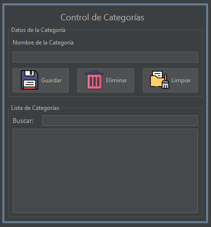

**Desglose de controles utilizados:**
<table>
 <thead>
    <tr> 
        <th>Control </th>
        <th>Propiedad </th>
        <th>Valor</th>
    </tr>
  </thead>
  <tbody>
  <tr>
  <td>JFrame</td>
    <td>defaultCloseOperation</td>
    <td>EXIT_ON_CLOSE</td>
  </tr>
  <tr>
    <td>jLabel</td>
    <td>text</td>
    <td>Control de Categoria</td>
  </tr>
  <tr>
    <td>JPanel</td>
    <td>border → titled border → title</td>
    <td>Datos de la Categoría</td>
  </tr>
  <tr>
    <td>JPanel</td>
    <td>border → titled border → title</td>
    <td>Lista de Categorías</td>
  </tr>
  <tr>
    <td>JLabel</td>
    <td>text</td>
    <td>Nombre de la categoría</td>
  </tr>
  <tr>
    <td rowspan=2>Text Field</td>
    <td>text</td>
    <td>"  " 👉🏻 Vació</td>
  </tr>
  <tr>
    <td>Variable Name</td>
    <td>txtNombreCat</td>
  </tr>

  <tr>
    <td rowspan=3>Button</td>
    <td>text</td>
    <td>Guardar</td>
  </tr>
  <tr>
    <td>Variable Name</td>
    <td>btnGuardar</td>
  </tr>
    <tr>
    <td>Icon</td>
    <td>Buscar el icono en el paquete de recurso</td>
  </tr>

 <tr>
    <td rowspan=3>Button</td>
    <td>text</td>
    <td>Eliminar</td>
  </tr>
  <tr>
    <td>Variable Name</td>
    <td>btnEliminar</td>
  </tr>
    <tr>
    <td>Icon</td>
    <td>Buscar el icono en el paquete de recurso</td>
  </tr>

 <tr>
    <td rowspan=3>Button</td>
    <td>text</td>
    <td>Limpiar</td>
  </tr>
  <tr>
    <td>Variable Name</td>
    <td>btnLimpiar</td>
  </tr>
    <tr>
    <td>Icon</td>
    <td>Buscar el icono en el paquete de recurso</td>
  </tr>
   <tr>
    <td>JLabel</td>
    <td>text</td>
    <td>Buscar:</td>
  </tr>
  <tr>
    <td rowspan=2>Text Field</td>
    <td>text</td>
    <td>"  " 👉🏻 Vació</td>
  </tr>
  <tr>
    <td>Variable Name</td>
    <td>txtBuscarCat</td>
  </tr>
  </tbody>

  <tr>
    <td>Table</td>
    <td>Variable Name</td>
    <td>tblListaCategorias</td>
  </tr>
</table>

En este punto se deberá de crear la lógica para que la interfaz gráfica de usuario obtenga los datos y los envié a traves del JDBC a la base de datos, por esta razón en se deberá generar el siguiente código en el JFrame con el nombre de "frmCategoria":

Como variables a nivel de clase se deberá crear las siguientes:

```java
   boolean nuevo = true; //Indicador para saber si es una categoría nueva
    int idCategoria = 0; //Almacenara el Id de la categoría a modificar/eliminar
    CategoriaJDBC cat = new CategoriaJDBC(); // Instancia de jdbc para el uso de los métodos
```

Ahora se deberá de crear dos métodos uno para limpiar los datos de los controles y el otro para obtener la información de las categorías de la base de datos:

```java
    public void cargarDatos(String categoria) {
        //Carga el modelo de la tabla con sus datos, gracias al método ConsultarCategoria del JDBC
        DefaultTableModel modelo = cat.consultarCategorias(categoria);
        tblListaCategorias.setModel(modelo);
    }
    
    public void limpiarDatos() {
        txtNombreCat.setText("");
        txtBuscarCat.setText("");
        idCategoria = 0;
        nuevo = true;
    }
```

Ahora en el evento clic del botón de guardar se requiere el siguiente código:

```java
 private void btnGuardarCatActionPerformed(java.awt.event.ActionEvent evt) {                                              

        String nombreCat = txtNombreCat.getText(); //Obtener el dato del textfield

        if (nombreCat.equals("")) {
            JOptionPane.showMessageDialog(this, "Debes digitar una nombre para la Categoría");
            return;
        }
        int row = 0;
        if (nuevo) {

            row = cat.registrarCategoria(nombreCat); //Llamar al metodo que encarga de registrar la categoria

            if (row > 0) {
                JOptionPane.showMessageDialog(this, "Se Registro la Categoría");
            } else {
                JOptionPane.showMessageDialog(this, "No Se Registro la Categoría", "Error", JOptionPane.ERROR_MESSAGE);
                return;
            }
        } else {
            row = cat.modificarCategoria(idCategoria, nombreCat); //Llamar al metodo que encarga de registrar la categoria
            if (row > 0) {
                JOptionPane.showMessageDialog(this, "Se Modifico la Categoría");
            } else {
                JOptionPane.showMessageDialog(this, "No Se Modifico la Categoría", "Error", JOptionPane.ERROR_MESSAGE);
                return;
            }
        }

        limpiarDatos();
        cargarDatos(null);
    }   
```

Luego se deberá generar un evento de tipo Mouse Pressed para la jTable y en el escribir el siguiente código:

```java
    private void tblListaCategoriasMousePressed(java.awt.event.MouseEvent evt) {                                                

        idCategoria = Integer.parseInt(tblListaCategorias.getValueAt(tblListaCategorias.getSelectedRow(), 0).toString());
        txtNombreCat.setText(tblListaCategorias.getValueAt(tblListaCategorias.getSelectedRow(), 1).toString());

        if (idCategoria > 0) {
            nuevo = false;
        }
    }   
```

En el código anterior lo que se obtiene el la fila seleccionada y los datos del id y el nombre de la categoría para su posterior modificación.

Luego se deberá de crear un evento KeyPress en el control txtBuscarCat y en el se digitar el siguiente código:

```java
    private void txtBuscarCatKeyReleased(java.awt.event.KeyEvent evt) {                                         
        String filtro = txtBuscarCat.getText();
        //Se invoca el método para cargar los datos pero se le pasa como parámetro el texto a buscar
        cargarDatos(filtro);
    }     
```

En el evento clic (actionPerformed) del botón de limpiar se escribe el siguiente código:

```java
    private void btnLimpiarCatActionPerformed(java.awt.event.ActionEvent evt) {                                              
        limpiarDatos();
    }             
``` 

En el evento clic (actionPerformed) del botón de Eliminar se deberá colocar el siguiente código:

```java

    private void btnEliminarCatActionPerformed(java.awt.event.ActionEvent evt) {                                               
        if(idCategoria == 0){
            JOptionPane.showMessageDialog(this, "Debes seleccionar una categoría para eliminarla", "Error", JOptionPane.ERROR_MESSAGE);
            return;
        }

        int opcion = JOptionPane.showConfirmDialog(this, "Esta segura que desea eliminar la categoría seleccionada?");

        if(opcion == 0){
            cat.eliminarCategoria(idCategoria);
            JOptionPane.showMessageDialog(this, "Se elimino la Categoría");
            limpiarDatos();
            cargarDatos(null);
        }
    } 
```

Luego se deberá modificar el constructor con nombre frmCategoria()

```java
    public frmCategoria() {
        initComponents();
        cargarDatos(null); //Se carga la lista de categorías 
    }
```

**El código Completo de la GUI de categoría se muestra a continuación:**

[Código de frmCategoria](./appRecetas-sqlserver-bdII/src/main/java/gui/frmCategoria.java)

#### Formulario de Ingredientes

Se deberá crear un JFrame con el nombre de frmControlIngredientes el el cual se deberá crear la interfaz similar a la que se muestra en la imagen:

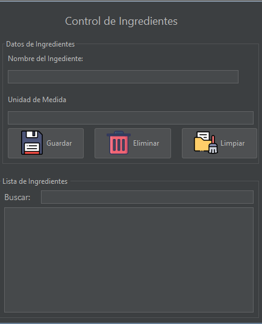

**Desglose de controles utilizados:**
<table>
 <thead>
    <tr> 
        <th>Control </th>
        <th>Propiedad </th>
        <th>Valor</th>
    </tr>
  </thead>
  <tbody>
  <tr>
  <td>JFrame</td>
    <td>defaultCloseOperation</td>
    <td>EXIT_ON_CLOSE</td>
  </tr>
  <tr>
    <td>jLabel</td>
    <td>text</td>
    <td>Control de Ingredientes</td>
  </tr>
  <tr>
    <td>JPanel</td>
    <td>border → titled border → title</td>
    <td>Datos de la Ingrediente</td>
  </tr>
  <tr>
    <td>JPanel</td>
    <td>border → titled border → title</td>
    <td>Lista de Ingredientes</td>
  </tr>
  <tr>
    <td>JLabel</td>
    <td>text</td>
    <td>Nombre del Ingrediente</td>
  </tr>
  <tr>
    <td rowspan=2>Text Field</td>
    <td>text</td>
    <td>"  " 👉🏻 Vació</td>
  </tr>
  <tr>
    <td>Variable Name</td>
    <td>txtNombreIng</td>
  </tr>
<tr>
    <td>JLabel</td>
    <td>text</td>
    <td>Unidad de medida</td>
  </tr>
  <tr>
    <td rowspan=2>Text Field</td>
    <td>text</td>
    <td>"  " 👉🏻 Vació</td>
  </tr>
  <tr>
    <td>Variable Name</td>
    <td>txtUnidadMedidaIng</td>
  </tr>
  <tr>
    <td rowspan=3>Button</td>
    <td>text</td>
    <td>Guardar</td>
  </tr>
  <tr>
    <td>Variable Name</td>
    <td>btnGuardar</td>
  </tr>
    <tr>
    <td>Icon</td>
    <td>Buscar el icono en el paquete de recurso</td>
  </tr>

 <tr>
    <td rowspan=3>Button</td>
    <td>text</td>
    <td>Eliminar</td>
  </tr>
  <tr>
    <td>Variable Name</td>
    <td>btnEliminar</td>
  </tr>
    <tr>
    <td>Icon</td>
    <td>Buscar el icono en el paquete de recurso</td>
  </tr>

 <tr>
    <td rowspan=3>Button</td>
    <td>text</td>
    <td>Limpiar</td>
  </tr>
  <tr>
    <td>Variable Name</td>
    <td>btnLimpiar</td>
  </tr>
    <tr>
    <td>Icon</td>
    <td>Buscar el icono en el paquete de recurso</td>
  </tr>
   <tr>
    <td>JLabel</td>
    <td>text</td>
    <td>Buscar:</td>
  </tr>
  <tr>
    <td rowspan=2>Text Field</td>
    <td>text</td>
    <td>"  " 👉🏻 Vació</td>
  </tr>
  <tr>
    <td>Variable Name</td>
    <td>txtBuscarIng</td>
  </tr>
  </tbody>

  <tr>
    <td>Table</td>
    <td>Variable Name</td>
    <td>tblListaIngredientes</td>
  </tr>
</table>

En este punto se deberá de crear la lógica para que la interfaz gráfica de usuario obtenga los datos y los envié a traves del JDBC a la base de datos, por esta razón en se deberá generar el siguiente código en el JFrame con el nombre de "frmIngredientes":

Como variables a nivel de clase se deberá crear las siguientes:

```java  
    boolean nuevo = true; //Indicador para saber si es una ingrediente nueva
    int id = 0; //Almacenara el Id del ingrediente a modificar/eliminar
    IngredienteJDBC ingredientejdbc = new IngredienteJDBC(); // Instancia de jdbc para el uso de los métodos
```

Ahora se deberá de crear dos métodos uno para limpiar los datos de los controles y el otro para obtener la información de los ingredientes de la base de datos:

```java
    public void cargarDatos(String ingrediente) {

        //VCarga el modelo de la tabla con sus datos, gracias al método ConsultarIngredientes del JDBC
        DefaultTableModel modelo = ingredientejdbc.consultarIngrediente(ingrediente);
        tblListaIngredientes.setModel(modelo);
    }
    
    public void limpiarDatos() {
        txtNombreIng.setText("");
        txtUnidadMedidaIng.setText("");
        txtBuscarIng.setText("");
        id = 0;
        nuevo = true;
    }
```

Ahora en el evento clic del botón de guardar se requiere el siguiente código:

```java
  private void btnGuardarIngActionPerformed(java.awt.event.ActionEvent evt) {                                              

        String nombreIng = txtNombreIng.getText(); //Obtener el dato del textfield
        String unidadMedida = txtUnidadMedidaIng.getText();
        
        if (nombreIng.equals("")) {
            JOptionPane.showMessageDialog(this, "Debes digitar una nombre para la ingrediente");
            return;
        }
          if (unidadMedida.equals("")) {
            JOptionPane.showMessageDialog(this, "Debes digitar una unidad de medida para la ingrediente");
            return;
        }
        int row = 0;
        if (nuevo) {

            row = ingredientejdbc.registrarIngredientes(nombreIng,unidadMedida); //Llamar al método que encarga de registrar el Ingrediente

            if (row > 0) {
                JOptionPane.showMessageDialog(this, "Se Registro el ingrediente");
            } else {
                JOptionPane.showMessageDialog(this, "No Se Registro el Ingrediente", "Error", JOptionPane.ERROR_MESSAGE);
                return;
            }
        } else {
            row = ingredientejdbc.modificarIngrediente(id, nombreIng, unidadMedida); //Llamar al método que encarga de registrar el Ingrediente
            if (row > 0) {
                JOptionPane.showMessageDialog(this, "Se modifico el ingrediente");
            } else {
                JOptionPane.showMessageDialog(this, "No Se modifico el ingrediente", "Error", JOptionPane.ERROR_MESSAGE);
                return;
            }
        }

        limpiarDatos();
        cargarDatos(null);
    }                                             
     
```

Luego se deberá generar un evento de tipo Mouse Pressed para la jTable y en el escribir el siguiente código:

```java
 private void tblListaIngredientesMousePressed(java.awt.event.MouseEvent evt) {                                                  

        id = Integer.parseInt(tblListaIngredientes.getValueAt(tblListaIngredientes.getSelectedRow(), 0).toString());
        txtNombreIng.setText(tblListaIngredientes.getValueAt(tblListaIngredientes.getSelectedRow(), 1).toString());
        txtUnidadMedidaIng.setText(tblListaIngredientes.getValueAt(tblListaIngredientes.getSelectedRow(), 2).toString());

        if (id > 0) {
            nuevo = false;
        }
    }                                                 
  
```

En el código anterior lo que se obtiene el la fila seleccionada y los datos del id, nombre y la unidad de medida  del ingrediente para su posterior modificación.

Luego se deberá de crear un evento KeyPress en el control txtBuscarIng y en el se digitar el siguiente código:

```java
  private void txtBuscarIngKeyReleased(java.awt.event.KeyEvent evt) {                                         
        String filtro = txtBuscarIng.getText();
        //Se invoca el método para cargar los datos pero se le pasa como parámetro el texto a buscar
        cargarDatos(filtro);
    }     
```

En el evento clic (actionPerformed) del botón de limpiar se escribe el siguiente código:

```java
    private void btnLimpiarIngActionPerformed(java.awt.event.ActionEvent evt) {                                              
        limpiarDatos();
    }                   
``` 

En el evento clic (actionPerformed) del botón de Eliminar se deberá colocar el siguiente código:

```java

    private void btnEliminarIngActionPerformed(java.awt.event.ActionEvent evt) {                                               
        if(id == 0){
            JOptionPane.showMessageDialog(this, "Debes seleccionar un ingrediente para eliminarla", "Error", JOptionPane.ERROR_MESSAGE);
            return;
        }

        int opcion = JOptionPane.showConfirmDialog(this, "Esta segura que desea eliminar el ingrediente seleccionada?");

        if(opcion == 0){
            ingredientejdbc.eliminarIngrediente(id);
            JOptionPane.showMessageDialog(this, "Se elimino el ingrediente");
            limpiarDatos();
            cargarDatos(null);
        }
    }                                              

```

Luego se deberá modificar el constructor con nombre frmCategoria()

```java
    public frmIngredientes() {
        initComponents();
        cargarDatos(null);
    }

```

**El código Completo de la GUI de categoría se muestra a continuación:**

[Código de frmIngredientes](./appRecetas-sqlserver-bdII/src/main/java/gui/frmIngredientes.java)